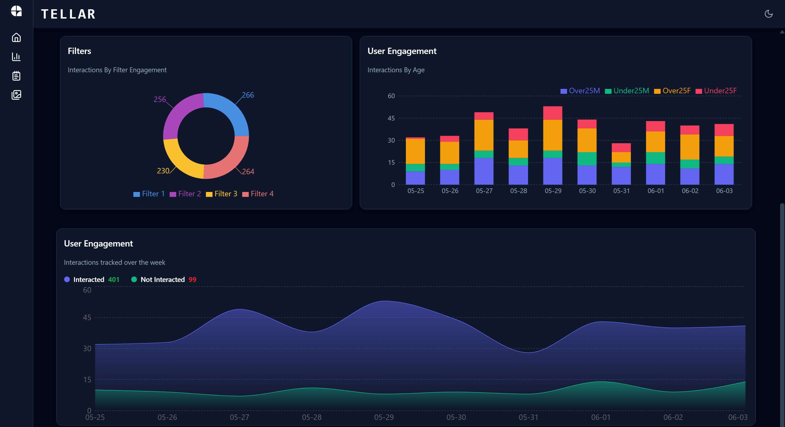

## <a name="introduction">💬 Introduction</a>

Welcome to the Data-Viz UI Design repository!

## <a name="tools">🛠️ Tools</a>

-   [React JS](https://react.dev)
-   [TailwindCSS](https://tailwindcss.com/)
-   [Lucide Icons](https://lucide.dev/)
-   [React Router](https://reactrouter.com/en/main)
-   [Recharts](https://recharts.org/en-US/)

## <a name="getting-started">🚀 Getting Started</a>

To get started follow these steps:

#### Cloning the Repository

Using CLI

```bash
git clone https://github.com/Mdeeq08/Data-visualization.git
```

**\*\*_Ensure you have installed [Git](https://git-scm.com) on your machine._**

or using GitHub:

-   Go to the project [repository](https://github.com/Mdeeq08/Data-visualization.git)
-   Click on the green button on the top 👆
-   Click Download ZIP

#### Installation

Install the project dependencies using npm:

```bash
npm install 
```

```Necessary packages you need to install 
npm install
 react react-dom 
 recharts 
 framer-motion 
 react-slick slick-carousel 
 prop-types
 jspdf jspdf-autotable 
 lucide-react
```

**\*\*_Ensure you have installed [NodeJS](https://nodejs.org/en) on your machine._**

#### Running the Project

```bash
npm start
```


####  Website content 




**\*\*_This project uses [Vite](https://vitejs.dev)._**
